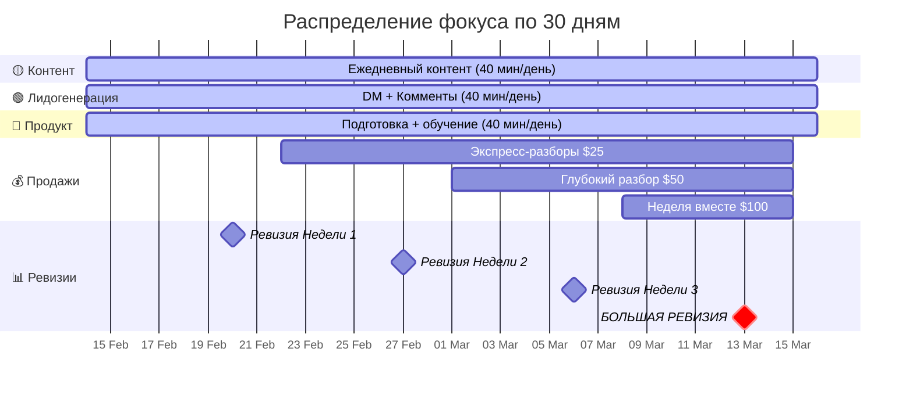

# 📋 Anna | Пошаговый План Действий — 30 дней

> **Дата:** 13 февраля 2026  
> **Аудиторы:** Brand Strategist · Product Architect (EdTech) · Narrative Psychology Expert  
> **Документ-компаньон к:** [ANNA_STRATEGIC_PLAN.md](https://github.com/shitty-dev/anna-strategic-plan/blob/main/ANNA_STRATEGIC_PLAN.md)  
> **Назначение:** Превратить стратегический план в **конкретные ежедневные действия** с таймингами, чеклистами и точками внимания

---

## 🔑 Как пользоваться этим документом

| Символ | Значение |
|:------:|----------|
| ⏰ | Время на задачу |
| 🎯 | Ключевой фокус дня |
| ⚠️ | Точка особого внимания (психологическая ловушка) |
| ✅ | Обязательный чеклист |
| 💡 | Совет от эксперта |
| 🔴 | Критический шаг — пропускать НЕЛЬЗЯ |
| 🟡 | Важный шаг — но можно сдвинуть на ±1 день |
| 🟢 | Бонусный шаг — если остались силы |

---

# ФАЗА 0: ПОДГОТОВКА (до старта)

## День -1: «Тихий вечер перед стартом»

> 🎯 **Фокус:** Внутренняя подготовка. Никаких публичных действий.

⏰ **Общее время: 60–90 мин**

### Чеклист

- [ ] **Прочитать ANNA_STRATEGIC_PLAN.md целиком** (30 мин)
  - Не как инструкцию, а как зеркало. Подчеркнуть фразы, которые вызывают отклик
- [ ] **Записать голосовое СЕБЕ** (10 мин)
  - На диктофон, НЕ для публикации
  - Ответить: «Зачем я это делаю? Что будет через 30 дней, если я сделаю всё? Что будет, если не сделаю ничего?»
- [ ] **Выбрать «якорь дня»** (5 мин)
  - Одна физическая привычка, к которой привязать рабочий блок
  - Пример: кофе → открываю ноутбук → 2 часа работы
- [ ] **Подготовить рабочее место** (15 мин)
  - Скачать приложения: Telegram (если нет), InShot или CapCut (для Reels)
  - Создать папку «Anna Content» в телефоне для фото/видео
  - Создать заметку «Банк идей» — сюда записывать мысли в течение дня

> ⚠️ **Психологическая ловушка:** «Мне надо ещё подготовиться, я начну послезавтра.»  
> **Противоядие:** Подготовка = МАКСИМУМ 1 вечер. Завтра — День 1. Без исключений.

---

# ФАЗА 1: ЗАЯВЛЕНИЕ (Дни 1–7)

> **Цель фазы:** Заявить о себе публично. Преодолеть первый барьер страха.  
> **Ожидаемый результат:** 5–7 публикаций, TG-канал создан, +20–50 подписчиков  
> **Доход фазы:** $0 (и это НОРМАЛЬНО)

---

## День 1 🔴 САМЫЙ ВАЖНЫЙ ДЕНЬ

> 🎯 **Фокус:** Опубликовать МАНИФЕСТ. Точка невозврата.

⏰ **Рабочий блок: 2 часа**

### Блок 1: Контент (50 мин)

| Шаг | Время | Действие | Детали |
|:---:|:-----:|----------|--------|
| 1 | 15 мин | **Написать манифест** | Взять шаблон из стратплана (раздел 1.1). Адаптировать своими словами. **Правило: макс. 3 редактуры.** Не идеально = идеально |
| 2 | 10 мин | **Выбрать фото** | Реальное фото, НЕ глянцевое. Бали, повседневность. Без фильтров или минимальные |
| 3 | 5 мин | **Опубликовать пост в Instagram** | Хештеги: #начатьсначала #послеразвода #женскаясила #самиопора (8–12 штук) |
| 4 | 10 мин | **Записать 3 Stories** | (1) «Я решила делать это публично» (2) «Вот что было» (3) «Вот что будет» |
| 5 | 10 мин | **Создать Telegram-канал** | Название: «Anna | Автономия» или похожее. Описание: 2 строки из манифеста. Ссылка в шапку IG |

### Блок 2: Лидогенерация (40 мин)

| Шаг | Время | Действие | Детали |
|:---:|:-----:|----------|--------|
| 6 | 15 мин | **Написать 10 DM** | Знакомым, подругам, бывшим клиентам. НЕ «подпишись», а: «Я запускаю проект, мне будет важна твоя поддержка. Вот ссылка» |
| 7 | 15 мин | **Оставить 10 комментов** | В целевых аккаунтах (женские коучи, психологи, блоги про развод). Комментарий = содержательный, НЕ спам |
| 8 | 10 мин | **Написать первый пост в TG** | Короткий: «Привет. Это будет дневник моей пересборки. Без фильтров. Каждый день.» |

### Блок 3: Внутренняя работа (30 мин)

| Шаг | Время | Действие |
|:---:|:-----:|----------|
| 9 | 10 мин | **Записать в дневник:** что чувствую после публикации |
| 10 | 10 мин | **Прочитать раздел 4.2** стратплана (Протокол «Мне страшно») |
| 11 | 10 мин | **Спланировать завтра** — открыть этот документ, прочитать День 2 |

> ⚠️ **Точка особого внимания:**  
> После публикации манифеста будет сильное желание удалить пост. **НЕ УДАЛЯТЬ.**  
> Тревога после публикации = нормальная реакция. Она пройдёт через 2–4 часа.  
> Если невыносимо — записать голосовое в TG: «Только что опубликовала и мне страшно» → это IS контент.

> 💡 **Brand Strategist:** Манифест — ваш фундамент. Всё дальнейшее строится на этом посте. Он не должен быть красивым, он должен быть НАСТОЯЩИМ.

---

## День 2

> 🎯 **Фокус:** Telegram-контент + первые Stories из повседневности

⏰ **Рабочий блок: 2 часа**

### Чеклист

- [ ] **Stories (3 шт, 15 мин):**
  - Утро на Бали: «Вот так начинается мой день» (фото/видео)
  - «Вчера опубликовала манифест. Вот что чувствую сегодня» (текст на фоне)
  - «Кто уже в Telegram? Завтра — первая настоящая запись» (CTA → TG)
- [ ] **TG-пост: «Утренние мысли» (20 мин):**
  - 5–7 предложений из дневника. Формат: что чувствую → что поняла → что сделаю сегодня
- [ ] **10 комментов в целевых аккаунтах (15 мин)**
- [ ] **5 личных DM (10 мин):**
  - Людям, которые лайкнули или посмотрели Stories. «Спасибо за поддержку. Как у тебя дела?»
- [ ] **Ответить на ВСЕ входящие сообщения (15 мин)**
- [ ] **Подготовка к Reels на завтра (20 мин):**
  - Прочитать таблицу Reels из стратплана (раздел 2.2)
  - Выбрать Reels #1: «Жалость — самый сладкий яд»
  - Написать скрипт (30 секунд текста = ~80 слов)
- [ ] **Спланировать завтра (5 мин)**

> 💡 **Narrative Psychology Expert:** День 2 — проверка инерции. Мозг будет говорить: «Вчера уже сделала, можно отдохнуть». Нет. 2 дня подряд = создание нейронной дорожки. 1 день = случайность.

---

## День 3 🔴

> 🎯 **Фокус:** Первый Reels. Самый страшный шаг после манифеста.

⏰ **Рабочий блок: 2 часа**

### Чеклист

- [ ] **Снять Reels #1 (30 мин):** 🔴
  - Тема: «Жалость — самый сладкий яд»
  - Формат: говорящая голова, 30–60 секунд
  - **ПРАВИЛО ПЕРВОГО ДУБЛЯ:** Снять 2 дубля. Выбрать лучший. Не переснимать.
  - Монтаж: CapCut/InShot, добавить субтитры, обрезать начало/конец
  - CTA в конце: «Продолжение в Telegram — ссылка в шапке»
- [ ] **Опубликовать Reels** с хештегами (10 мин)
- [ ] **Stories (2 шт, 10 мин):**
  - «Только что сняла первый Reels. Руки тряслись»
  - Репост собственного Reels с реакцией
- [ ] **TG-пост: голосовое 2–3 мин (15 мин):**
  - «Как я снимала первый Reels» — raw, без монтажа
- [ ] **10 комментов + 5 DM (25 мин)**
- [ ] **Планирование (10 мин):** Прочитать День 4

> ⚠️ **Точка особого внимания:**  
> Reels — самый высокий барьер страха. Ожидаемая реакция: «Я ужасно выгляжу», «Кто это будет смотреть», «Нужно переснять».  
> **Если этот страх есть — вы на правильном пути.** Страх = рост. Удобно = стагнация.

> 💡 **Product Architect:** Первый Reels получит мало просмотров. Это нормально. Алгоритм Instagram начнёт продвигать после 5–7 Reels. Сейчас вы тренируете НАВЫК, а не собираете просмотры.

---

## День 4

> 🎯 **Фокус:** Образовательный контент (Треугольник Карпмана)

⏰ **Рабочий блок: 2 часа**

### Чеклист

- [ ] **Написать пост: «Треугольник Карпмана в моём браке» (30 мин):** 🔴
  - Структура: Что это → Как это было у меня → Как выйти
  - Длина: 800–1200 знаков
  - CTA: «Узнала себя? Напиши в комментах 🔺 — покажу выход»
- [ ] **Stories (3 шт, 15 мин):**
  - Визуалка Треугольника (нарисовать на бумаге, сфоткать)
  - «Какая роль тебе знакома больше?» (опрос: Жертва / Спасатель / Преследователь)
  - CTA → TG: «Полный разбор + упражнение — в Telegram»
- [ ] **TG-пост: упражнение (20 мин):**
  - «Определи свою привычную роль. Вспомни 3 ситуации за последнюю неделю. Какую роль ты заняла?»
- [ ] **Нетворкинг (40 мин):**
  - 15 комментов (искать посты про развод, отношения, кризис)
  - 5 DM людям, которые лайкнули/прокомментировали
  - Ответить на все входящие
- [ ] **Планирование (5 мин)**

> 💡 **Brand Strategist:** Этот пост позиционирует вас как ЭКСПЕРТА с живым опытом. Баланс «история + инструмент» — это золото. Люди делятся постами, в которых узнают СЕБЯ.

---

## День 5

> 🎯 **Фокус:** Финансовая прозрачность (рискованный, но мощный контент)

⏰ **Рабочий блок: 2 часа**

### Чеклист

- [ ] **Stories: «Мой честный бюджет» (20 мин):** 🟡
  - 3–5 Stories: Сколько стоит жить на Бали. Сколько осталось. Что планирую зарабатывать.
  - Тон: не жалость, а прозрачность. «Вот реальность. И вот что я с ней делаю.»
- [ ] **Reels #2: подготовка + съёмка (30 мин):** 🔴
  - Тема: «Первый день, когда я не плакала»
  - Формат: тихий, интимный, камера близко
  - CTA → TG: «Мой дневник процесса — в Telegram»
- [ ] **TG: текст «Пятничная честность» (15 мин):**
  - Что было тяжело на этой неделе. Без приукрашивания.
- [ ] **Нетворкинг (40 мин):**
  - 15 комментов + 5 DM + ответы на входящие
- [ ] **Планирование выходных (10 мин)**

> ⚠️ **Точка особого внимания:**  
> Пост про деньги вызовет стыд. Мозг скажет: «Ты выглядишь как нищенка». Правда: прозрачность про финансы РЕЗКО повышает доверие. Люди в кризисе чувствуют «она такая же» — и подписываются.

---

## День 6

> 🎯 **Фокус:** Публикация Reels #2 + батчинг контента

⏰ **Рабочий блок: 2 часа**

### Чеклист

- [ ] **Опубликовать Reels #2 (10 мин)**
- [ ] **Stories (2 шт, 10 мин):** Репост Reels + «Суббота на Бали. Что делаю для себя»
- [ ] **TG: бонус-контент (20 мин):**
  - Мини-чеклист: «5 вопросов, которые помогут понять — ты в Треугольнике Карпмана?»
- [ ] **🟢 Батчинг Reels на следующую неделю (60 мин):**
  - Написать скрипты для Reels #3, #4, #5
  - Если есть энергия — снять 2–3 Reels за одну сессию
  - Важно: разная одежда/фон для каждого ролика
- [ ] **Планирование (10 мин):** Прочитать День 7

> 💡 **Product Architect:** Батчинг = страховка от выгорания. Снять 3 Reels за 1 час в субботу проще, чем снимать 1 каждый день под давлением. Если сегодня нет сил снимать — просто напишите скрипты.

---

## День 7 🔴

> 🎯 **Фокус:** Первый ЭФИР (Live / Q&A). Прямой контакт с аудиторией.

⏰ **Рабочий блок: 2 часа + 30 мин эфир**

### Чеклист

- [ ] **Подготовка к эфиру (30 мин):**
  - Тема: «Спроси что угодно — честные ответы»
  - Подготовить 5 вопросов самой себе (на случай тишины)
  - Выбрать место: хороший свет, тихий фон
  - Анонс в Stories за 2–3 часа до эфира
- [ ] **Провести эфир (30 мин):** 🔴
  - Начать с: «Привет. Это мой первый эфир. Мне страшно, но я здесь»
  - Отвечать на вопросы / рассказывать свою историю
  - В конце: CTA → «Всё продолжение и дневник — в Telegram, ссылка в шапке»
- [ ] **Stories после эфира (10 мин):**
  - «Пережила первый эфир 😅» (скриншот или селфи)
- [ ] **TG: Q&A — ответы на вопросы подписчиков (20 мин)**
- [ ] **Нетворкинг (20 мин):** 10 комментов + 5 DM
- [ ] **📊 Ревизия Недели 1 (30 мин):** 🔴

### Ревизия Недели 1

| Метрика | Цель | Факт |
|---------|:----:|:----:|
| Постов/Stories опубликовано | 10+ | ___ |
| Reels опубликовано | 2 | ___ |
| TG-подписчики | 20–50 | ___ |
| DM отправлено | 50+ | ___ |
| Комментов оставлено | 70+ | ___ |
| Входящих запросов | 3–5 | ___ |
| Эфиров проведено | 1 | ___ |
| Продаж | 0 ← НОРМАЛЬНО | ___ |

> ⚠️ **Точка особого внимания:**  
> Конец первой недели — классическое «плато разочарования». Результаты кажутся мизерными. 20 подписчиков — это «мало».  
> **Правда:** 20 живых подписчиков за неделю с нуля — это ОТЛИЧНО. 90% людей бросают до этого момента. Вы уже в топ-10%.

> 💡 **Narrative Psychology Expert:** Перечитайте запись голосового из Дня -1. Сравните, как вы чувствовали себя ДО старта и СЕЙЧАС. Запишите новое голосовое: «Что изменилось за неделю?»

---

# ФАЗА 2: ПЕРВЫЕ ПРОДАЖИ (Дни 8–14)

> **Цель фазы:** Объявить оффер. Провести 3–5 экспресс-разборов. Получить первые отзывы.  
> **Ожидаемый результат:** $75–$125 дохода, 3+ отзыва  
> **Психологический порог:** Назвать цену вслух

---

## День 8 🔴

> 🎯 **Фокус:** ОБЪЯВИТЬ ОФФЕР. Первый раз сказать «вот моя услуга, вот цена».

⏰ **Рабочий блок: 2 часа**

### Чеклист

- [ ] **Написать пост-оффер (40 мин):** 🔴
  - Структура:
    1. «Несколько человек спросили, как я могу помочь» (даже если не спросили — это маркетинговая рамка)
    2. «Я провожу экспресс-разборы» — что это, для кого, что получит
    3. Цена: **$25 за 30 минут** (или первые 3 — donation от $15)
    4. CTA: «Напиши в DM слово РАЗБОР»
  - **НЕ извиняться за цену. НЕ писать «денег не хватает». Это услуга, не попрошайничество.**
- [ ] **Reels #3 (из батча): опубликовать (10 мин)**
  - Тема: «Твоя боль — не весь ты»
- [ ] **Stories (3 шт, 15 мин):**
  - (1) Анонс оффера — короткое видео: «Я открыла запись на экспресс-разборы»
  - (2) Что входит (текст на фоне)
  - (3) CTA: «Напиши РАЗБОР в DM»
- [ ] **TG-пост (15 мин):**
  - «Я запускаю экспресс-разборы. Первые 5 мест — по специальной цене. Пишите в личку»
- [ ] **Нетворкинг (40 мин):**
  - Увеличить до 20 комментов + 10 DM (описать оффер тем, кто проявлял интерес)

> ⚠️ **Точка особого внимания:**  
> Стыд «продавать в кризисе» будет МАКСИМАЛЬНЫМ в этот день. Внутренний голос: «Кто я такая, чтобы брать деньги?»  
> **Переосмысление:** «Мой навык распаковки убеждений — это НАВЫК. Он не зависит от моей ситуации. Врач лечит, даже когда у него насморк.»  
> Перечитать раздел «Риск 2» в стратплане.

---

## Дни 9–13: Ежедневный ритм продаж

> 🎯 **Фокус:** Провести первые консультации + собрать отзывы

Каждый день в Фазе 2 следует **одинаковому шаблону:**

### Ежедневный шаблон (2 часа + время на консультации)

| Время | Блок | Действия |
|:-----:|------|----------|
| 40 мин | **Контент** | 2–3 Stories (процесс дня) + 1 TG-пост (дневник/упражнение) |
| 40 мин | **Лидогенерация** | 15 комментов + 10 DM + ответы на входящие |
| 40 мин | **Продукт** | Подготовка к консультациям + записать инсайты после + попросить отзыв |
| +30 мин | **Консультация** | Если есть запись — провести. Если нет — отправить 5 доп. DM |

### Специфика по дням

| День | 🔴/🟡 Ключевое действие |
|:----:|------------------------|
| **9** | 🟡 Reels #4: «Выживание зависит от дискомфорта» + активно продвигать оффер в DM |
| **10** | 🔴 **Первая консультация!** Провести → записать инсайты → попросить текстовый отзыв |
| **11** | 🟡 Карусель в IG: «5 признаков, что ты в Треугольнике Карпмана» |
| **12** | 🟡 TG: эксклюзив — «Мой процесс за 2 недели: цифры и честность» |
| **13** | 🔴 **Бесплатный мини-эфир** (20 мин): разбор кейса подписчицы + CTA на платный разбор |

### Как проводить первую консультацию (День 10)

| Этап | Время | Что делать |
|------|:-----:|-----------|
| **Раппорт** | 5 мин | «Расскажи, что сейчас происходит. Как ты себя чувствуешь?» |
| **Распаковка** | 15 мин | Слушать. Задавать: «А что за этим стоит? Чего ты НА САМОМ ДЕЛЕ боишься?» |
| **Отзеркаливание** | 5 мин | Показать паттерн: «Слышишь, что ты сейчас сказала? Вот это — ключевое убеждение» |
| **Один инсайт** | 3 мин | Дать 1 конкретный ресефйм: новый взгляд на ситуацию |
| **Завершение** | 2 мин | «Что ты понимаешь сейчас, чего не понимала час назад?» + предложить следующий шаг |

> 💡 **Narrative Psychology Expert:** Не пытайтесь «решить проблему» за 30 минут. Цель экспресс-разбора — дать человеку увидеть ОДНУ вещь, которую он не видел. Один сдвиг восприятия = ценность.

---

## День 14 🔴

> 🎯 **Фокус:** Ревизия Фазы 2 + публикация первого отзыва + подготовка к масштабированию

⏰ **Рабочий блок: 2.5 часа**

### Чеклист

- [ ] **Опубликовать отзыв клиента (20 мин):** 🔴
  - Скриншот переписки (с разрешения) или текстовый отзыв
  - Пост: «Вот что сказала Маша после нашего разбора» + своя рефлексия
- [ ] **Reels #5: «Ты не сломана — ты в пересборке» (30 мин)**
- [ ] **Stories: итоги 2 недель (15 мин):**
  - «14 дней назад я написала манифест. Вот что произошло с тех пор»
- [ ] **TG: эксклюзивное упражнение недели (20 мин)**
- [ ] **📊 Ревизия Недели 2 + Фазы 2 (30 мин):** 🔴

### Ревизия Фазы 2

| Метрика | Цель | Факт |
|---------|:----:|:----:|
| Консультаций проведено | 3–5 | ___ |
| Доход | $75–$125 | ___ |
| Отзывов получено | 3+ | ___ |
| TG-подписчики | 50–100 | ___ |
| Reels опубликовано (всего) | 5 | ___ |
| DM отправлено (за фазу) | 70+ | ___ |

> ⚠️ **Если продаж 0:**  
> Не паниковать. Проверить: (1) Оффер опубликован? (2) DM отправлены? (3) CTA в каждом посте?  
> Чаще всего проблема = недостаточно DM. Увеличить до 15–20/день.

---

# ФАЗА 3: МАСШТАБ (Дни 15–21)

> **Цель фазы:** Добавить «Глубокий разбор» ($50). Набрать обороты.  
> **Ожидаемый результат:** $225–$375 нарастающим, TG: 100–150, 5+ отзывов  

---

### Ключевые действия по дням

| День | 🔴/🟡 Действие | ⏰ Время |
|:----:|---------------|:-------:|
| **15** | 🔴 Объявить новый продукт: «Глубокий разбор — 60 мин, $50» | Пост + Stories + TG |
| **16** | 🟡 Reels #6: «Алименты — не стратегия жизни» | 30 мин |
| **17** | 🔴 Провести первый Глубокий разбор | +60 мин |
| **18** | 🟡 Пост: «Мой первый клиент — что произошло» (кейс-стори) | 30 мин |
| **19** | 🟡 Stories: «Прогресс за 3 недели» | 15 мин |
| **20** | 🔴 TG-эксклюзив: развёрнутое упражнение + голосовое | 30 мин |
| **21** | 🔴 **Ревизия Фазы 3** + планирование финального рывка | 30 мин |

### Ежедневный ритм остаётся тем же:

- 40 мин контент + 40 мин лидогенерация + 40 мин продукт
- Увеличить DM до **15/день** (фокус: люди, которые реагируют на Stories/Reels)

> 💡 **Brand Strategist:** На 3-й неделе начнёт работать «эффект снежного кома» — люди, которые наблюдали молча, начнут писать. Ключевое: НЕ прекращать ежедневный контент, даже если кажется, что никто не смотрит.

---

# ФАЗА 4: УСКОРЕНИЕ (Дни 22–30)

> **Цель фазы:** Запустить «Неделя вместе» ($100). Выйти на $800–$1,000 за месяц.  
> **Ожидаемый результат:** 15–23 клиента за месяц, TG: 200+

---

### Ключевые действия по дням

| День | 🔴/🟡 Действие |
|:----:|---------------|
| **22** | 🔴 Объявить «Неделя вместе» — $100 (пост + Stories + TG + DM) |
| **23** | 🟡 Reels #7: «Тебе не нужно быть готовой» |
| **24** | 🟡 Stories: «Кто приходит на мои консультации» (обобщённые портреты) |
| **25** | 🟡 Reels #8: «Зависимость — комфортная тюрьма» |
| **26** | 🔴 Пост с полным оффером: «Как работать со мной — все форматы» |
| **27** | 🟡 Reels #9: «Сильной не надо. Надо честной» |
| **28** | 🔴 Итоговый эфир: «Что я поняла за 30 дней» |
| **29** | 🟢 Планирование Месяца 2: переход к мини-курсу |
| **30** | 🔴 **БОЛЬШАЯ РЕВИЗИЯ** — итоги всего месяца |

---

## День 30 🔴 БОЛЬШАЯ РЕВИЗИЯ

⏰ **Рабочий блок: 3 часа**

### Итоговые метрики

| Метрика | Минимум | Цель | Факт |
|---------|:-------:|:----:|:----:|
| **Доход** | $500 | $1,000 | ___ |
| **Клиентов** | 10 | 23 | ___ |
| **TG-подписчики** | 100 | 250 | ___ |
| **Reels** | 7 | 10 | ___ |
| **Отзывов** | 5 | 10 | ___ |
| **Эфиров** | 2 | 4 | ___ |
| **DM отправлено** | 200 | 400+ | ___ |

### Чеклист ревизии

- [ ] Заполнить таблицу метрик
- [ ] Записать голосовое: «Что я чувствую сегодня vs День 1»
- [ ] Прочитать все отзывы клиентов
- [ ] Выписать: 3 вещи, которые работали лучше всего
- [ ] Выписать: 3 вещи, которые нужно изменить
- [ ] Прочитать ANNA_STRATEGIC_PLAN.md → раздел 3.2 «Продуктовая лестница»
- [ ] Начать планирование мини-курса «Первые шаги» ($150–$300)
- [ ] Опубликовать итоговый пост: «30 дней. Что изменилось»

---

# 📐 ПРАВИЛА, КОТОРЫЕ НЕЛЬЗЯ НАРУШАТЬ

### 7 золотых правил на все 30 дней

| # | Правило | Почему |
|---|---------|--------|
| 1 | **Публиковать КАЖДЫЙ ДЕНЬ** (хотя бы 1 Story) | Алгоритмы и доверие требуют регулярности |
| 2 | **DM — минимум 5/день** | Это ГЛАВНЫЙ канал продаж на старте |
| 3 | **Не удалять опубликованное** | Стыд пройдёт, контент останется |
| 4 | **Правило 1-го дубля** для Reels | 2 дубля максимум. «Сойдёт» = идеально |
| 5 | **1 день в неделю — тишина** | Воскресенье = отдых. Колодец нужно заполнять |
| 6 | **Записывать ВСЁ** | Каждый инсайт, каждый отзыв, каждый страх — это будущий контент |
| 7 | **Не сравнивать себя с блогерами на 100k** | Сравнивать только с собой вчера |

---

# ⏱️ СВОДКА: Распределение времени по неделям

---

# 🧠 КАРТА ПСИХОЛОГИЧЕСКИХ ЛОВУШЕК

> **Narrative Psychology Expert:** Каждая неделя имеет свою характерную ловушку. Знать их заранее = пройти через них, а не застрять.

| Неделя | Ловушка | Внутренний голос | Противоядие |
|:------:|---------|-----------------|-------------|
| **1** | Страх начала | «Я не готова. Начну на следующей неделе» | Открыть камеру → таймер 5 мин → опубликовать |
| **2** | Стыд продажи | «Кто я такая, чтобы брать деньги?» | «Навык ≠ Состояние. Я умею — значит, имею право» |
| **3** | Плато разочарования | «Ничего не работает. 100 подписчиков — это ноль» | Перечитать отзывы клиентов. 100 > 0. Точка |
| **4** | Усталость + самосаботаж | «Я устала. Может, это не моё» | 1 день отдыха → 1 голосовое в TG → вернуться |

$$
\text{Прогресс} = \text{Действие}^{\text{Дни подряд}} - \text{Перфекционизм} \times \text{Сравнение с другими}
$$

---

# 🎯 МАТРИЦА «ЕСЛИ... ТО...»

> Для ситуаций, когда не знаешь что делать

| Если... | То... |
|---------|-------|
| Нет идей для контента | Открыть «Банк идей» или взять любую тему из таблицы 10 Reels в стратплане |
| Никто не пишет в DM | Увеличить исходящие DM до 15–20/день. Проблема = охват, не продукт |
| Написали, но не покупают | Предложить donation-формат ($15 минимум) — снизить барьер входа |
| Нет сил снимать Reels | Записать голосовое в TG (лёжа, 2 мин) — это ТОЖЕ контент |
| Хейтерский комментарий | Не отвечать. Скриншот → контент: «Вот что мне написали. Вот что я думаю» |
| Сорвалась на 2 дня | НЕ начинать заново. Просто опубликовать: «Пропала на 2 дня. Вот почему» |
| Клиент просит скидку | «Я ценю, что ты хочешь поработать. Цена фиксированная — это уважение к моему времени и к твоему процессу» |
| Хочется всё бросить | Записать голосовое СЕБЕ. Перечитать манифест Дня 1. Позвонить подруге. Не принимать решений в тревоге |

---

> [!IMPORTANT]
> ### 🏁 Главный принцип этого плана
>
> **Идеальный день = 2 часа дисциплинированного действия.**  
> **Плохой день = 1 голосовое в Telegram + 3 DM.**  
> **Единственный провал = 0 действий 3 дня подряд.**
>
> Не нужно быть идеальной. Нужно быть ЗДЕСЬ. Каждый день.

---

*Этот план создан для человека, который действует, пока страшно. Не после. Не когда будет готов. А прямо сейчас.*
