# 🧭 Anna | Ментор Женской Автономии — Полный Стратегический План

> **Дата:** 13 февраля 2026  
> **Аудиторы:** Brand Strategist · Product Architect (EdTech) · Narrative Psychology Expert  
> **Объект:** Персональный бренд + коучинговый продукт «Женская Автономия»  
> **Горизонт:** 30 дней (MVP) → 90 дней (фундамент) → 6–12 мес (масштаб)

---

## 📊 Executive Summary — Ключевые параметры

| Параметр | Значение |
|----------|----------|
| **Основатель** | Анна, 37 лет, Бали, в процессе перезапуска жизни |
| **Ниша** | Женская автономия · Выход из роли жертвы · Внутренняя опора |
| **Целевая аудитория** | Женщины 28–45 в кризисе: развод, потеря себя, финансовая зависимость |
| **Бэкграунд** | Потеря активов → развод → клиническая депрессия → пересборка |
| **Активы** | Коучинг-опыт ($1,5–$2k), глубокое слушание, распаковка убеждений, живой кейс |
| **Финансовый runway** | 2–3 месяца |
| **Цель: Месяц 1** | $1,000/мес |
| **Цель: Месяц 3** | $2,000–$3,000/мес |
| **Рабочий ресурс** | 2 часа/день дисциплинированного действия |
| **Главный риск** | Страх проявляться + стыд «продавать в кризисе» |
| **Главное преимущество** | Живой процесс трансформации = максимальная близость с аудиторией |

---

# РАЗДЕЛ 1: ИДЕНТИЧНОСТЬ И ПОЗИЦИОНИРОВАНИЕ

## 1.1 Архетип «Раненый Целитель» — модель «В Процессе»

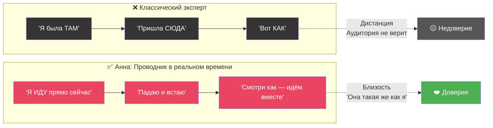

### Формула доверия

$$
\text{Доверие} = \text{Результат}_{\text{прошлое}} \times \text{Прозрачность}_{\text{настоящее}} \times \text{Видение}_{\text{будущее}}
$$

- **Результат (прошлое):** Ослаблен — нет массовых кейсов, но ЕСТЬ опыт ($1,5–2k доход, клиенты, личная трансформация)
- **Прозрачность (настоящее):** Может быть **экстремально высокой** — живой процесс пересборки
- **Видение (будущее):** Чёткая философия: «Не лёгкую жизнь — а СИЛУ жить любую жизнь»

### Core Positioning (Ядро позиционирования)

> *«Жизнь не обязана быть стерильной и безопасной. Проблемы будут всегда. Разница лишь в том, кто ты перед лицом проблемы: маленькая девочка, которая плачет «я не могу», или взрослая женщина, которая говорит «я пока не умею, но я разберусь».*

### Трансформация эмоций: барьер → мост

| Эмоция Анны | ❌ Барьер (если скрывать) | ✅ Мост (если раскрыть) |
|-------------|-------------------------|------------------------|
| **Страх** | «Она сама не знает, куда идёт» | «Она делает ВОПРЕКИ страху — значит, и я могу» |
| **Стыд** | «Она потерпела неудачу» | «Она не прячется — мне тоже не нужно» |
| **Тревога** | «Нестабильный эксперт» | «Она честна — я могу ей доверять» |
| **Фин. нестабильность** | «Сапожник без сапог» | «Она строит на моих глазах — это РЕАЛЬНО» |

> [!IMPORTANT]
> **Манифест Анны (черновик для первого поста):**  
> _«Полгода назад я потеряла всё: активы, брак, себя. Я прошла через клиническую депрессию и знаю цену выхода из кризиса не по книжкам. Сегодня у меня бюджет на 2 месяца, я на Бали, и я пересобираю свою жизнь публично. Каждый день. По кирпичику. Не потому что я сильная. А потому что я решила: я пока не умею, но я разберусь. Если ты сейчас в похожей точке — идём вместе.»_

---

## 1.2 Целевая аудитория — Глубокое погружение

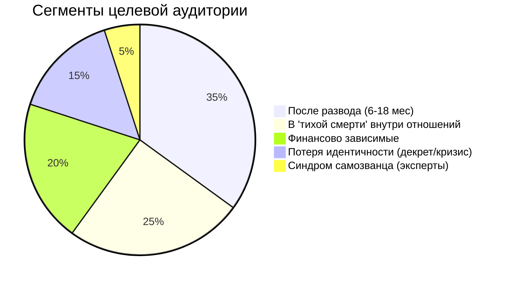

### Аватар: «Лена, 34 года»

| Параметр | Описание |
|----------|----------|
| **Ситуация** | Развелась 6 месяцев назад. Ребёнок 4 года. Нелюбимая работа. Живёт у мамы. |
| **Внутренний голос** | «Я всё испортила» · «Другие справляются, а я нет» · «Мне уже 34, поздно» |
| **Поведение ночью** | Листает Instagram, ищет подтверждение, что «не одна такая» |
| **Триггер покупки** | Увидела живую историю + почувствовала: «Она такая же, но ДЕЛАЕТ» |
| **Бюджет** | $20–$50/мес на себя — максимум |
| **Главный барьер** | «А вдруг это очередной развод на деньги» |

### «Ночные шёпоты» — что крутится в голове в 2 часа ночи

| Мысль | Скрытая потребность | Как Анна отвечает |
|-------|-------------------|-------------------|
| _«Что со мной не так?»_ | Нормализация | «С тобой всё так. Ситуация — не ты» |
| _«Я одна с этим»_ | Принадлежность | Telegram-сообщество + ежедневный дневник |
| _«Я слишком старая / поздно»_ | Примеры | «Мне 37. Я начинаю заново. Прямо сейчас» |
| _«Я не справлюсь одна»_ | Система поддержки | Формат «Неделя вместе» — ежедневный чекин |
| _«Мне стыдно просить о помощи»_ | Безопасное пространство | Telegram как «комната без осуждения» |

### Вторичные выгоды позиции жертвы

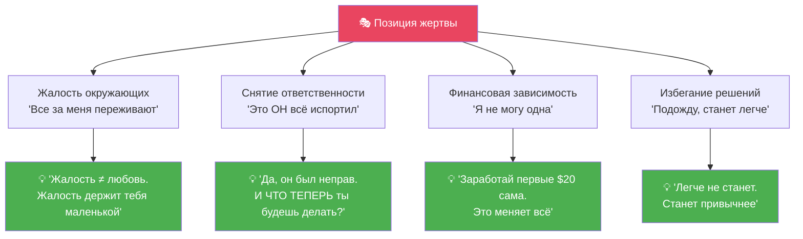

$$
\text{Сопротивление}_{\text{клиента}} = \frac{\text{Вторичные выгоды} \times \text{Страх неизвестности}}{\text{Боль от текущей ситуации} \times \text{Доверие к проводнику}}
$$

> [!TIP]
> **Стратегическая задача Анны:** Увеличивать знаменатель (усиливать осознание боли + выстраивать доверие), а не бороться с числителем (вторичные выгоды никуда не денутся, но перестанут быть «выгодными»).

---

# РАЗДЕЛ 2: 30-ДНЕВНАЯ КОНТЕНТ-СТРАТЕГИЯ

## 2.1 Контент-план на 30 дней

### Принцип: «Документирование, а не декларирование»

Анна не «учит жизни». Анна **показывает свой процесс** — и экспертность возникает естественно.

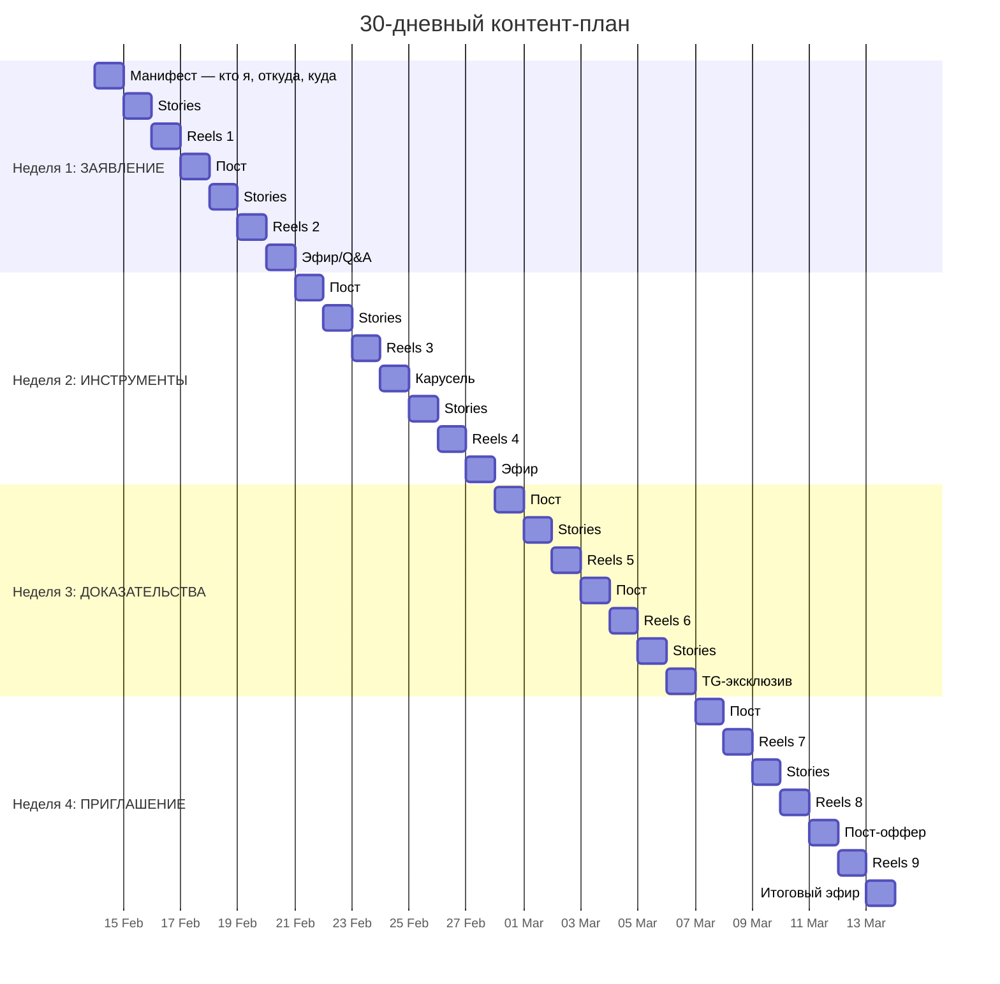

### Тональность контента — Анти-инфоцыганство

| ❌ НЕ делать | ✅ Делать |
|-------------|----------|
| Глянцевые фото с пляжа | Реальные кадры из повседневности |
| «5 шагов к счастью» | «Вот 1 вещь, которая помогла мне сегодня» |
| Инфобиз-язык («Прокачай себя!») | Живой язык («Я чуть не сдалась сегодня») |
| Атака на бывших | Фокус на СВОЁМ процессе |
| Обещания трансформации | Приглашение к совместному процессу |
| «Я знаю ответ на всё» | «Я пока не умею, но разберусь — и покажу как» |

---

## 2.2 10 концепций Reels (высокий импакт)

> Каждый Reels = **1 острая мысль** + **Эмоциональный хук** + **CTA в Telegram**

| # | 🎣 Хук (первые 2 сек) | 💡 Ядро | 📲 CTA |
|---|----------------------|---------|--------|
| **1** | «Жалость — самый сладкий яд» | Жалость = внимание, но ценой самоуважения. Жалость держит тебя маленькой. | → TG: «3 шага выхода из роли жертвы» |
| **2** | «Первый день, когда я не плакала» | Исцеление — не момент, а когда замечаешь: «О, сегодня не плакала». | → TG: «Мой дневник процесса» |
| **3** | «Твоя боль — не весь ты» | Боль реальна, но ты — это действия, не чувства. Ты ≠ твоя ситуация. | → TG: «Упражнение: отделить боль от идентичности» |
| **4** | «Выживание зависит от дискомфорта» | Зона комфорта в кризисе = зона отрицания. Выход — через неудобное. | → TG: «Напиши ВЫХОД — получи первый шаг» |
| **5** | «Ты не сломана. Ты в пересборке» | Кинцуги: золотом по трещинам. Не хуже — другая версия. | → TG: «Мой процесс пересборки — каждый день» |
| **6** | «Алименты — не стратегия жизни» | Деньги от бывшего = зависимость в новой обёртке. Автономия начинается с $1. | → TG: «План первых $100 своими руками» |
| **7** | «Тебе не нужно быть готовой» | «Правильный момент» = прокрастинация высшего уровня. Начни с того, что есть. | → TG: «Как я начала, не будучи готовой» |
| **8** | «Зависимость — комфортная тюрьма» | Знакомая боль менее страшна, чем незнакомая свобода. Но тюрьма остаётся тюрьмой. | → TG: «Если ты ещё "сидишь" — напиши мне» |
| **9** | «Сильной не надо. Надо быть честной» | «Сила» — маска. Реальная сила = уязвимость + честность. | → TG: «Я показываю тень каждый день» |
| **10** | «Он не плохой. Ты переросла клетку» | Не про виноватых. Про то, что рост ломает старую форму. | → TG: «Если ты перерастаешь — заходи» |

---

## 2.3 Структура воронки: Reels → Telegram → Продажа

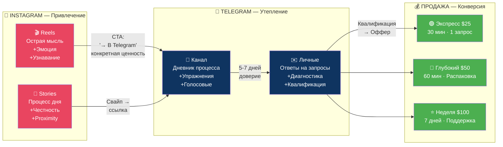

### Правила CTA (перевод из Instagram в Telegram)

| ❌ Пустой CTA | ✅ Ценностный CTA |
|-------------|------------------|
| «Подписывайся на канал» | «Записала голосовое, как пережила эту ночь — в Telegram» |
| «Ссылка в шапке» | «Упражнение, которое помогло не сорваться — в Telegram» |
| «Переходи, там интересно» | «Напиши ВЫХОД в Telegram — пришлю первый шаг» |

$$
\text{Конверсия}_{\text{IG→TG}} = \frac{\text{Ценность TG-эксклюзива}}{\text{Усилие подписки}} \times \text{Срочность}
$$

### Контент для Telegram-канала

| День | Формат | Содержание |
|------|--------|-----------|
| **Пн** | Текст + Фото | «Утренние мысли» — 3-5 предложений из дневника |
| **Вт** | Голосовое (2-3 мин) | «Что я поняла вчера» — raw, без монтажа |
| **Ср** | Упражнение | Мини-задание + обсуждение в комментариях |
| **Чт** | Карточка/Цитата | «Инсайт недели» — визуальная мысль |
| **Пт** | Текст | «Пятничная честность» — что было тяжело |
| **Сб** | Бонус-контент | Чеклист / аудио-разбор / мини-урок (эксклюзив) |
| **Вс** | Q&A | Ответы на сообщения, взаимодействие |

> [!TIP]
> **Ключевой принцип:** Telegram — это «комната без осуждения». Не продажная площадка, а безопасное пространство. Продажи возникают через доверие, а не через давление.

---

# РАЗДЕЛ 3: ПРОДУКТ И ПЛАН МОНЕТИЗАЦИИ

## 3.1 MVP — Минимальный жизнеспособный продукт

### Философия Анны → Продукт

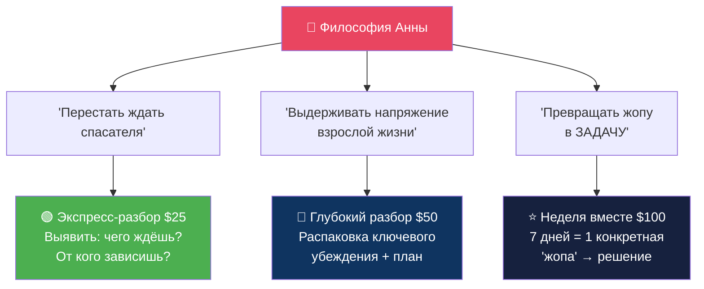

### Детали продуктов

| Параметр | 🟢 Экспресс-разбор | 🔵 Глубокий разбор | ⭐ Неделя вместе |
|----------|:------------------:|:------------------:|:----------------:|
| **Цена** | $25 | $50 | $100 |
| **Формат** | 30 мин Zoom/TG | 60 мин Zoom | 7 дней в TG-чате |
| **Содержание** | 1 запрос → 1 ключевое убеждение → 1 инсайт | Полная распаковка + работа с убеждениями + план | 1 сессия + ежедневный чекин + 2 задания |
| **Ёмкость** | до 3/день | 1/день | 5 одновременно |
| **Идеально для** | «Не знаю с чего начать» | «Хочу разобраться глубоко» | «Мне нужна поддержка рядом» |

### Финансовая математика: путь к $1,000/мес

$$
\text{Доход}_{\text{мес}} = \sum_{i=1}^{n} P_i \times Q_i = 25 \times 12 + 50 \times 8 + 100 \times 3 = 300 + 400 + 300 = \$1{,}000
$$

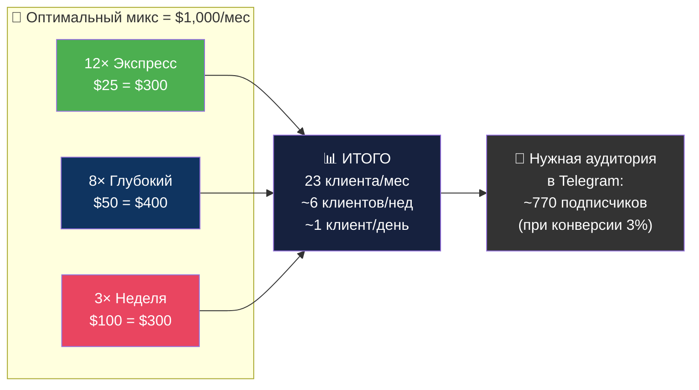

> [!NOTE]
> **Реалистичная оценка:** Месяц 1 с высокой вероятностью = $500–$800. $1,000 достижимы при агрессивном нетворкинге и ежедневном контенте. Месяц 2: $1,000–$1,500. Месяц 3: $2,000–$3,000.

---

## 3.2 Продуктовая лестница — от MVP к флагману

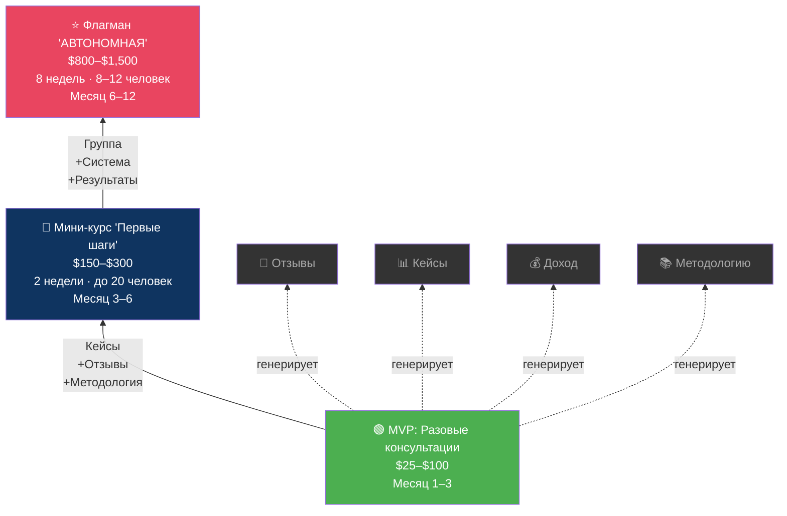

### Потенциал масштабирования

| Горизонт | Продукт | Клиенты | Доход/мес |
|----------|---------|:-------:|:---------:|
| **Месяц 1–3** | Разовые консультации $25–$100 | 15–30 | $500–$1,500 |
| **Месяц 3–6** | + Мини-курс $150–$300 | 10–20 запуск | $2,000–$4,000 |
| **Месяц 6–12** | + Флагман $800–$1,500 | 8–12 на поток | $5,000–$15,000 |

---

# РАЗДЕЛ 4: СИСТЕМА ИСПОЛНЕНИЯ «2 ЧАСА»

## 4.1 Ежедневный план действий

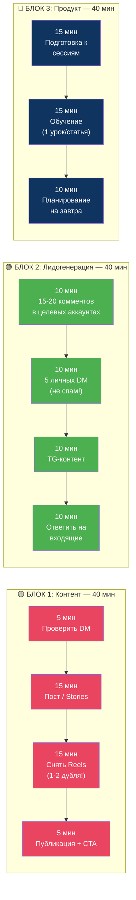

### Распределение времени

| Блок | Время | % | Цель |
|------|:-----:|:-:|------|
| 🟡 **Контент** | 40 мин | 33% | Видимость + охват |
| 🟢 **Лидогенерация** | 40 мин | 33% | Подписчики + лиды |
| 🔵 **Продукт** | 40 мин | 33% | Подготовка + рост |
| ⬛ **Консультации** | +30–60 мин | бонус | Доход (вне блока) |

---

## 4.2 Протокол «Мне страшно» — как действовать в тревоге

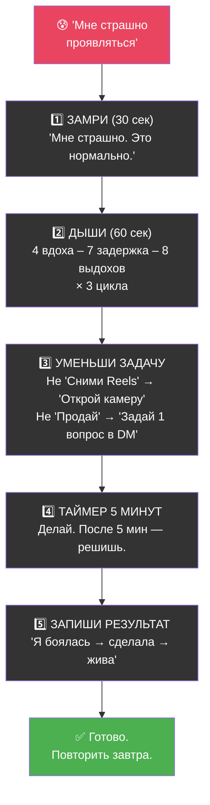

$$
\text{Действие} = f(\text{Микрошаги} \times \text{Самосострадание}), \quad \text{а НЕ} \quad f(\text{Мотивация} \times \text{Готовность})
$$

### Еженедельный чеклист минимальных действий

| Действие | Мин. | Цель |
|----------|:----:|------|
| Опубликовать 5 постов/Stories | 5 | Видимость |
| Опубликовать 2 Reels | 2 | Рост |
| Написать 25 личных DM | 25 | Лиды |
| Опубликовать 5 Telegram-постов | 5 | Утепление |
| Провести 1 эфир/Q&A | 1 | Доверие |
| Получить 1–3 продажи | 1–3 | Доход |
| Записать 1 отзыв | 1 | Соц. доказательство |

---

# СВОДНЫЕ РАЗДЕЛЫ

## SUMMARY A: 10 идей для Reels

| # | 🎣 Хук | 💡 Ядро сообщения | 📲 CTA |
|---|--------|------------------|--------|
| **1** | «Жалость — самый сладкий яд» | Жалость парализует. Она подкрепляет позицию жертвы. | → TG: «3 шага выхода из жертвы» |
| **2** | «Первый день, когда я не плакала» | Исцеление — не вспышка. Это тихий момент, когда замечаешь: сегодня не плакала. | → TG: «Мой дневник процесса» |
| **3** | «Твоя боль — не весь ты» | Ты ≠ ситуация. Ты — это то, что ты ДЕЛАЕШЬ, пока больно. | → TG: «Упражнение: отделить боль от идентичности» |
| **4** | «Выживание зависит от дискомфорта» | Зона комфорта в кризисе = зона отрицания. | → TG: «Напиши ВЫХОД — первый шаг» |
| **5** | «Ты не сломана. Ты в пересборке» | Кинцуги: золотом по трещинам. Не хуже — другая. | → TG: «Мой процесс пересборки» |
| **6** | «Алименты — не стратегия» | Деньги от бывшего = зависимость в обёртке. | → TG: «План первых $100» |
| **7** | «Не нужно быть готовой. Нужно начать» | «Правильный момент» = прокрастинация. | → TG: «Как я начала без готовности» |
| **8** | «Зависимость — комфортная тюрьма» | Знакомая боль < незнакомая свобода. Но тюрьма = тюрьма. | → TG: «Если ещё "сидишь" — напиши» |
| **9** | «Сильной не надо. Надо честной» | «Сила» — маска. Реальная сила = уязвимость. | → TG: «Показываю тень каждый день» |
| **10** | «Он не плохой. Ты переросла клетку» | Не про виноватых. Про рост, который ломает форму. | → TG: «Если перерастаешь — заходи» |

---

## SUMMARY B: Дорожная карта $1,000 — следующие 30 дней

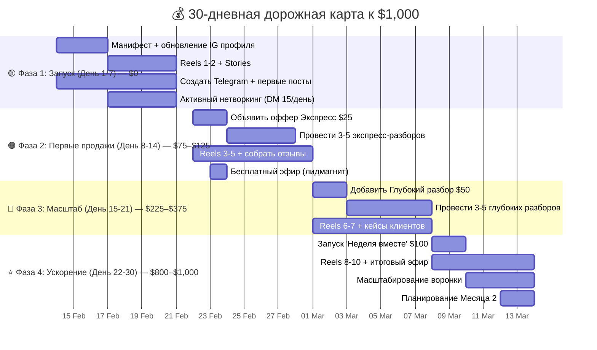

### Финансовые вехи

| Веха | День | Метрика | Доход (нарастающий) |
|------|:----:|---------|:-------------------:|
| IG-профиль обновлён + TG создан | 3 | Контент: 3 поста, TG: +20 | $0 |
| 2 Reels опубликованы | 7 | TG: +70, DM: 60 отправлено | $0 |
| Первая продажа! | 10 | 1-3 экспресс-разбора | $25–$75 |
| Первые 5 клиентов | 14 | 3+ отзыва, TG: +100 | $75–$125 |
| Глубокий разбор запущен | 17 | 3 Глубоких проведено | $225–$275 |
| 10+ клиентов всего | 21 | 5+ отзывов, TG: +200 | $375–$500 |
| «Неделя вместе» запущена | 25 | 2-3 пакета проданы | $575–$700 |
| **Итог месяца** | **30** | **15-23 клиента, TG: 250+** | **$800–$1,000** |

---

## SUMMARY C: Топ-3 критических риска

### Риск 1: 🔴 Страх публичного заявления

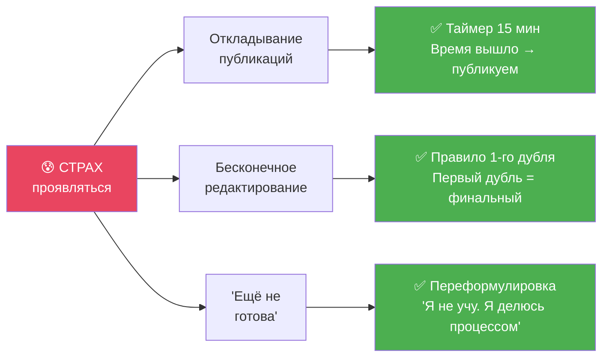

$$
\text{Прокрастинация} = \frac{\text{Перфекционизм} \times \text{Страх осуждения}}{\text{Ясность цели} \times \text{Размер шага}}
$$

> [!IMPORTANT]
> **Главная перезапись:** «Мне разрешено быть в процессе. Мне разрешено зарабатывать, пока я расту. Врач не перестаёт лечить, когда болеет гриппом.»

---

### Риск 2: 🟡 Стыд «продавать в кризисе»

| Уровень | Митигация |
|---------|-----------|
| **Переосмысление** | «Навык ≠ Состояние. Я умею распаковывать убеждения. Это факт. Моя ситуация не отменяет мой навык.» |
| **Доказательная база** | Записать 10 конкретных результатов прошлых клиентов. Перечитывать перед каждой продажей. |
| **Ценовой якорь** | $25 за 30 мин = 3 кофе на Бали. Это НЕ дорого. Это уважение к своему времени. |
| **Постепенность** | Первые 3 консультации — donation (от $15). Далее — фиксированная цена. |

---

### Риск 3: 🟠 Выгорание от ежедневного контента

| Уровень | Митигация |
|---------|-----------|
| **Батчинг** | Снимать 3-4 Reels за 1 сессию (воскресенье). Публиковать по 1 в течение недели. |
| **Шаблоны** | 5 повторяющихся форматов: утренние мысли, инсайт дня, ответ подписчице, упражнение, итог недели. |
| **Дни тишины** | 1 день/неделю — никакого контента. Заполнение «колодца». |
| **Делегирование** | К месяцу 2: ассистент для монтажа ($50–$100/мес). |

$$
\text{Энергия}_{\text{доступная}} = \text{Энергия}_{\text{базовая}} - \text{Тревога} - \text{Быт} - \text{Изоляция}
$$

> [!CAUTION]
> **Если 2 дня подряд не можешь заставить себя работать** — это не лень, это истощение. Протокол: 1 день полного отдыха → 1 голосовое в Telegram (2 мин, лёжа) → на следующий день полный блок. Не ломать систему, а гнуть.

---

## ПРИЛОЖЕНИЕ: Матрица приоритетов

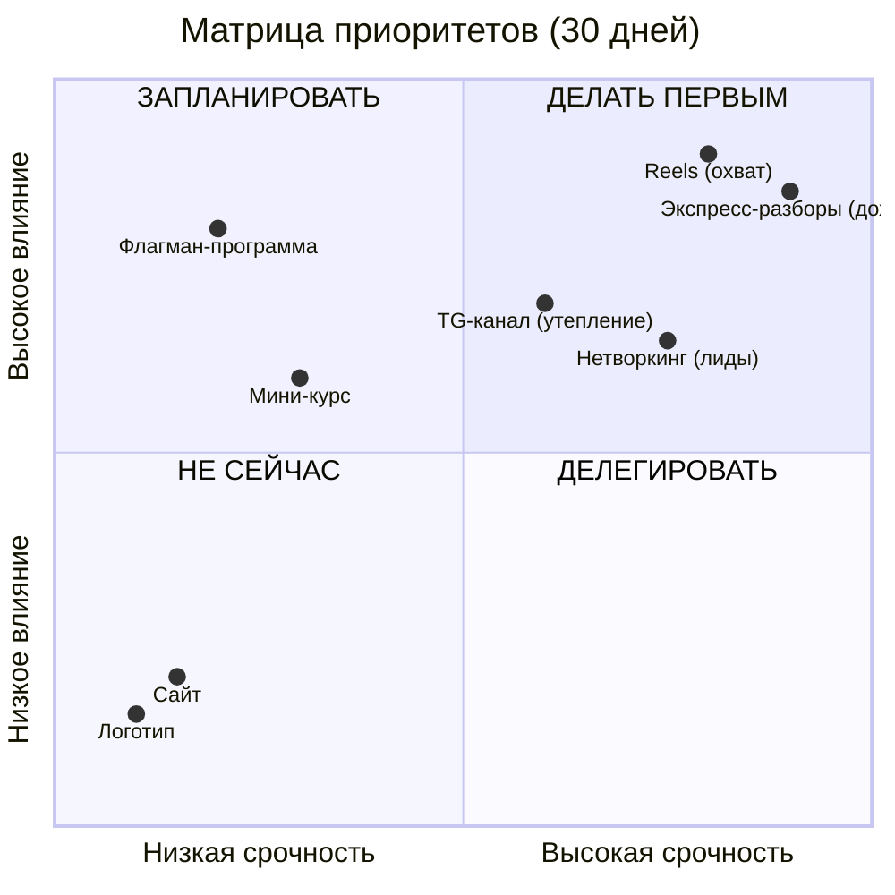

### Сводная формула стратегии

$$
\boxed{
\text{Успех}_{\text{Анна}} = \underbrace{\text{Честность}}_{\text{Позиционирование}} \times \underbrace{\text{Регулярность}}_{\text{Контент}} \times \underbrace{\text{Доступность}}_{\text{Цена}} \times \underbrace{\text{Микрошаги}}_{\text{Исполнение}}
}
$$

> [!IMPORTANT]
> ### 🎯 Главный вывод
>
> Анна — не «сломанный эксперт». Анна — **проводник в реальном времени**. Её уязвимость — не слабость, а **главное конкурентное преимущество**. Рынок устал от «успешного успеха». Рынок голоден по настоящему.
>
> **Три приоритета на ближайшие 7 дней:**
> 1. **Манифест** — опубликовать первый пост (правило 1-го дубля)
> 2. **Telegram-канал** — создать + первые 3 поста
> 3. **Первый DM-раунд** — 15 сообщений целевым аккаунтам
>
> **Следующий шаг:** Анна выбирает дату старта (рекомендация: **завтра**) и публикует МАНИФЕСТ.

---

*Этот план построен на принципе «Радикальной Честности». Здесь нет обещаний лёгкого пути. Есть система для человека, который решил действовать, пока страшно.*

*Стратегическая ревизия: через 30 дней.*
