# 🧭 Anna | Ментор Женской Автономии — Стратегический План v2.0

> **Дата:** 13 февраля 2026  
> **Аудиторы:** Brand Strategist · Product Architect (EdTech) · Narrative Psychology Expert  
> **Объект:** Персональный бренд + коучинговый продукт «Женская Автономия»  
> **Горизонт:** 30 дней (MVP) → 90 дней (фундамент) → 6–12 мес (масштаб)  
> **v2.0:** Интегрирована распаковка, ДНК клиента, продуктовая линейка

---

## 📊 Executive Summary — Ключевые параметры

| Параметр | Значение |
|----------|----------|
| **Основатель** | Анна, 37 лет, Бали, в процессе перезапуска жизни |
| **Ниша** | Женская автономия · Выход из зависимости · Внутренняя опора |
| **Целевая аудитория** | Женщины 28–45 в кризисе: развод, потеря себя, финансовая зависимость |
| **Бэкграунд** | Потеря активов → развод → клиническая депрессия → пересборка |
| **Активы** | Коучинг-опыт ($1,5–$2k), глубокое слушание, распаковка убеждений, живой кейс |
| **Финансовый runway** | 2–3 месяца |
| **Цель: Месяц 1** | $1,000/мес |
| **Цель: Месяц 3** | $2,000–$3,000/мес |
| **Цель: Месяц 6–12** | $5,000–$15,000/мес (флагман + VIP) |
| **Рабочий ресурс** | 2 часа/день дисциплинированного действия |
| **Главный риск** | Страх проявляться + стыд «продавать в кризисе» |
| **Главное преимущество** | Живой процесс трансформации = максимальная близость с аудиторией |

### Позиционирование (из распаковки)

> *«Я работаю с женщинами, которые разучились опираться на себя — и возвращаю им внутренний стержень, силу и взрослую автономию.»*

> *«Я помогаю выйти из зависимости — финансовой, эмоциональной, психологической — и стать женщиной, которую невозможно оставить без воздуха.»*

---

# РАЗДЕЛ 1: ИДЕНТИЧНОСТЬ И ПОЗИЦИОНИРОВАНИЕ

## 1.1 Архетип «Раненый Целитель» — модель «В Процессе»

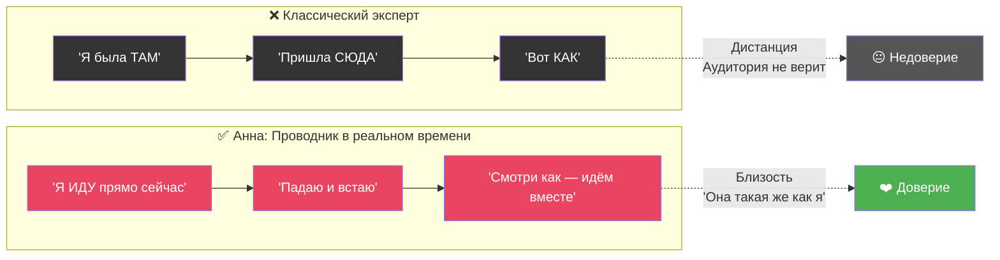

### Формула доверия

$$
\text{Доверие} = \text{Результат}_{\text{прошлое}} \times \text{Прозрачность}_{\text{настоящее}} \times \text{Видение}_{\text{будущее}}
$$

- **Результат (прошлое):** Ослаблен — нет массовых кейсов, но ЕСТЬ опыт ($1,5–2k доход, клиенты, личная трансформация)
- **Прозрачность (настоящее):** Может быть **экстремально высокой** — живой процесс пересборки
- **Видение (будущее):** Чёткая философия: «Не лёгкую жизнь — а СИЛУ жить любую жизнь»

### Core Positioning (из Распаковки)

> *«Жизнь не обязана быть стерильной и безопасной. Проблемы будут всегда. Разница лишь в том, кто ты перед лицом проблемы: маленькая девочка, которая плачет «я не могу», или взрослая женщина, которая говорит «я пока не умею, но я разберусь».*

### Трансформация эмоций: барьер → мост

| Эмоция Анны | ❌ Барьер (если скрывать) | ✅ Мост (если раскрыть) |
|-------------|-------------------------|------------------------|
| **Страх** | «Она сама не знает, куда идёт» | «Она делает ВОПРЕКИ страху — значит, и я могу» |
| **Стыд** | «Она потерпела неудачу» | «Она не прячется — мне тоже не нужно» |
| **Тревога** | «Нестабильный эксперт» | «Она честна — я могу ей доверять» |
| **Фин. нестабильность** | «Сапожник без сапог» | «Она строит на моих глазах — это РЕАЛЬНО» |

### Чем Анна отличается от других коучей (из Распаковки)

| Большинство на рынке | Анна |
|---------------------|------|
| «Давай поверим в себя, поплачем, визуализируем» | Отказ от иллюзий → ответственность → действие |
| Перепрошивка мышления | Ломает старую логику выживания, строит опорную |
| Сюсюканье и поддержка | Структура: реальность → ответственность → шаги → деньги |
| «Проработки» | Действия. Каждый день |
| Обещания «будет легко» | «Тебе сейчас страшно. И ты всё равно обязана встать» |

> [!IMPORTANT]
> **Манифест Анны (для первого поста):**  
> _«Полгода назад я потеряла всё: активы, брак, себя. Я прошла через клиническую депрессию и знаю цену выхода из кризиса не по книжкам. Сегодня у меня бюджет на 2 месяца, я на Бали, и я пересобираю свою жизнь публично. Каждый день. По кирпичику. Не потому что я сильная. А потому что я решила: я пока не умею, но я разберусь. Если ты сейчас в похожей точке — идём вместе.»_

---

## 1.2 Целевая аудитория — ДНК Клиента

### Демографическое ядро

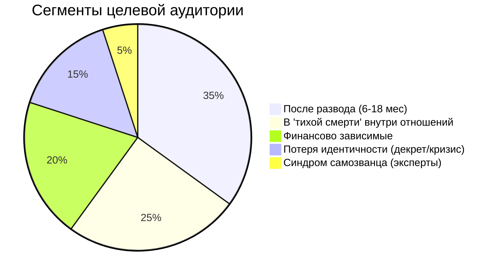

| Параметр | Данные |
|----------|--------|
| **Пол** | Женщины 90–95% |
| **Возраст** | Ядро: 28–45 лет, пик: 32–40 |
| **Доход** | Низкий–средний, часто нестабильный, часто НЕ свой (через мужчину) |
| **География** | Русскоязычные: РФ, СНГ, экспаты |
| **Жизненный этап** | Переход из «выживающей» в «взрослую» |
| **Самоидентификация** | «Обычная женщина», «просто мама», «не из сильных» |

### Возрастная динамика (из ДНК клиента)

| Возраст | Состояние | Ключевой страх |
|:-------:|-----------|----------------|
| **28–32** | Иллюзии, надежда «само сложится», вера в мужчину | «Не успеть» |
| **32–38** | Ломка картины мира, тупик, выгорание | «Я живу не свою жизнь» |
| **38–45** | Экзистенциальная тревога, готовность к трансформации | «Время упущено» |

### Аватар: «Лена, 34 года» (расширенный)

| Параметр | Описание |
|----------|----------|
| **Ситуация** | Развелась 6 мес назад. Ребёнок 4 года. Нелюбимая работа. Живёт у мамы |
| **Роль выживания** | Удобная, покорная, благодарная «за крошки», улыбающаяся когда больно |
| **Внутренний голос** | «Я всё испортила» · «Без него я не выживу» · «Мне уже 34, поздно» |
| **Поведение ночью** | Листает Instagram, ищет подтверждение, что «не одна такая» |
| **Триггер покупки** | Увидела живую историю + «Она такая же, но ДЕЛАЕТ» |
| **Бюджет** | $20–$50/мес — и это РИСК для неё |
| **Барьер** | «А вдруг это очередной развод на деньги» |
| **Решение о покупке** | Формально — она. Фактически — страх + доверие к проводнику |

### «Ночные шёпоты» — внутренний монолог в 2 часа ночи (из ДНК клиента)

| Мысль | Скрытая потребность | Как Анна отвечает |
|-------|-------------------|-------------------|
| _«Без него я не выживу. У меня нет своих денег»_ | Безопасность | «Заработай первые $20 сама. Это меняет всё» |
| _«Я слишком маленькая одна»_ | Опора | «Ты не маленькая. Ты взрослая, которая никогда не стояла на своих ногах» |
| _«Что со мной не так?»_ | Нормализация | «С тобой всё так. Ситуация — не ты» |
| _«Я одна с этим»_ | Принадлежность | Telegram-сообщество + ежедневный дневник |
| _«Если я потрачу и не изменится — я не переживу это морально»_ | Контроль | $25 за 30 мин = 3 кофе. Исследуй, не обязывайся |
| _«А вдруг я просто безнадёжная?»_ | Надежда | «Мне 37. Я начинаю заново. Прямо сейчас» |

### Вторичные выгоды позиции жертвы (из Распаковки)

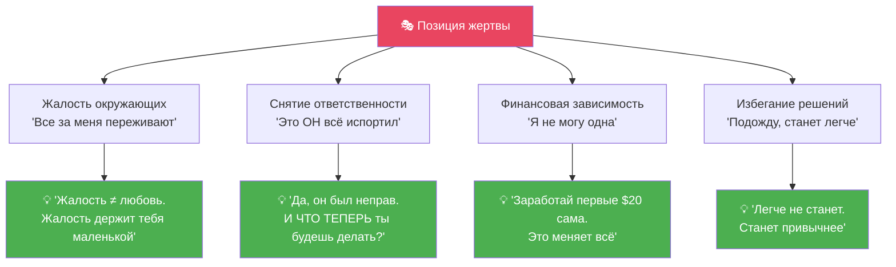

### Кто НЕ клиент Анны (из Распаковки)

| ✘ Не клиент | Почему |
|------------|--------|
| Ищет «волшебную таблетку» | Анна про действие, не про магию |
| Хочет, чтобы кто-то «вытащил» | Анна возвращает ответственность |
| Жертва, которая хочет жалости | Анна не гладит по голове |
| Хочет лайфхаков, не трансформации | Анна работает с корнем |
| Ноет вместо действий | Анна про взрослых женщин |

$$
\text{Сопротивление}_{\text{клиента}} = \frac{\text{Вторичные выгоды} \times \text{Страх неизвестности}}{\text{Боль от ситуации} \times \text{Доверие к проводнику}}
$$

> [!TIP]
> **Стратегическая задача:** Увеличивать знаменатель (усиливать осознание боли + выстраивать доверие), а не бороться с числителем.

---

## 1.3 Язык и коммуникация — ДНК клиента

### Слова, которые ПОПАДАЮТ в ЦА

| Категория | Слова |
|-----------|-------|
| **Страх** | застряла, дно, край, тупик, яма, пропасть, хаос, паника |
| **Боль** | зависимость, выживание, бег по кругу, безысходность, пустота, истощение |
| **Стыд** | слабая, беспомощная, никчёмная, ненужная, лишняя, зависимая |
| **Метафоры проблемы** | «кручусь как белка», «тону», «болото», «тащу на себе», «всё сыпется» |
| **Метафоры решения** | «выбраться», «встать на ноги», «расправить плечи», «почувствовать землю» |

### Язык контента — Анти-инфоцыганство

| ❌ ТАБУ-слова | ✅ Живой язык |
|-------------|-------------|
| Уникальная методика, секретная система | «Вот что помогло мне сегодня» |
| Гарантия результата | «Я не обещаю лёгкого. Обещаю честное» |
| Квантовый скачок, трансформация за 7 дней | «Маленькие шаги. Каждый день» |
| «Поверь в себя», «выйди из зоны комфорта» | «Тебе страшно. Мне тоже. Делаем» |
| Пассивный доход, мышление миллионера | «Первые $20 своими руками» |
| Только сегодня! Последний шанс! | «Я здесь. Когда будешь готова — напиши» |

### Формула хуков (из ДНК)

> «Ты не ленишься. Ты застряла.»  
> «Ты не слабая. Ты устала.»  
> «Ты не сломанная. Ты перегружена.»

**Правило:** Короткие фразы. Простые слова. Живая речь. Без пафоса. Без терминов. Без обещаний.

---

# РАЗДЕЛ 2: 30-ДНЕВНАЯ КОНТЕНТ-СТРАТЕГИЯ

## 2.1 Контент-план на 30 дней

### Принцип: «Документирование, а не декларирование»

Анна не «учит жизни». Анна **показывает свой процесс** — и экспертность возникает естественно.

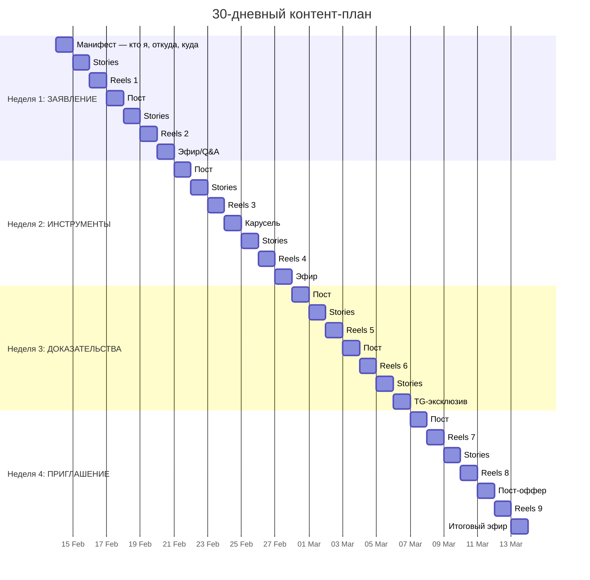

### Контент-ДНК: 3 ключевые темы (из Распаковки)

| Тема | Ядро | Примеры контента |
|------|------|-----------------|
| **🧠 Женщина как автономная система** | Опора на себя, не на мужчину. Финансы, границы, решения | «Как стать взрослой внутри», «Первые $20 сами» |
| **💔 Выход из зависимости и жертвенности** | Треугольник Карпмана, «хорошая девочка», страх уйти | «5 признаков зависимости в отношениях» |
| **💰 Первая внутренняя победа → первые деньги** | Действие вместо паники. Мини-шаги. Ошибки как норма | «Алименты — не стратегия», «План первых $100» |

### Эмоции, которые вызывает контент Анны (из Распаковки)

- 😤 Дискомфорт (потому что правда)
- 😠 Злость на свою старую роль
- 🙏 Уважение к Анне
- 🌅 Надежда на новую жизнь
- 💪 Желание встать и что-то сделать
- 💔 «Она говорит обо мне»

> **Почему после страницы Анны хочется либо уйти, либо остаться навсегда:**  
> Нет промежуточной зоны. Те, кто не готовы — убегают (угроза отговоркам). Те, кто созрел — остаются (она единственная, кто не будет гладить, но будет вести к силе).

---

## 2.2 10 концепций Reels (высокий импакт)

> Каждый Reels = **1 острая мысль** + **Эмоциональный хук** + **CTA в Telegram**

| # | 🎣 Хук (первые 2 сек) | 💡 Ядро | 📲 CTA |
|---|----------------------|---------|--------|
| **1** | «Жалость — самый сладкий яд» | Жалость = внимание, но ценой самоуважения | → TG: «3 шага выхода из роли жертвы» |
| **2** | «Первый день, когда я не плакала» | Исцеление — не момент, а тихое «о, сегодня не плакала» | → TG: «Мой дневник процесса» |
| **3** | «Твоя боль — не весь ты» | Ты ≠ ситуация. Ты — это действия, не чувства | → TG: «Упражнение: отделить боль от идентичности» |
| **4** | «Выживание зависит от дискомфорта» | Зона комфорта в кризисе = зона отрицания | → TG: «Напиши ВЫХОД — получи первый шаг» |
| **5** | «Ты не сломана. Ты в пересборке» | Кинцуги: золотом по трещинам. Не хуже — другая | → TG: «Мой процесс пересборки — каждый день» |
| **6** | «Алименты — не стратегия жизни» | Деньги от бывшего = зависимость в новой обёртке | → TG: «План первых $100 своими руками» |
| **7** | «Тебе не нужно быть готовой» | «Правильный момент» = прокрастинация высшего уровня | → TG: «Как я начала, не будучи готовой» |
| **8** | «Зависимость — комфортная тюрьма» | Знакомая боль менее страшна, чем незнакомая свобода | → TG: «Если ты ещё "сидишь" — напиши мне» |
| **9** | «Сильной не надо. Надо быть честной» | «Сила» — маска. Реальная сила = уязвимость + честность | → TG: «Я показываю тень каждый день» |
| **10** | «Он не плохой. Ты переросла клетку» | Не про виноватых. Про рост, который ломает старую форму | → TG: «Если ты перерастаешь — заходи» |

---

## 2.3 Полная воронка: Reels → Telegram → Продажа

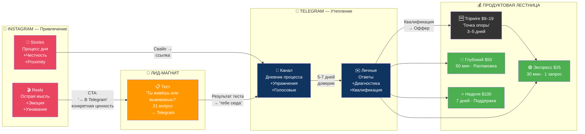

### Лид-магниты (из Продуктовой линейки)

| Лид-магнит | Формат | Цель |
|-----------|--------|------|
| **«Ты живёшь или выживаешь?»** | Квиз / PDF (21 вопрос) | Сломать иллюзию. Создать идентификацию боли |
| **«Симулятор развода»** | Психо-файл | Что будет, если мужчина исчезнет (реальность, не страх) |
| **«День без опоры»** | Челлендж | Проживи день как автономная женщина |
| **«Карта зависимости»** | Визуальная схема | Где ты держишься за людей, а не за себя |
| **«Письмо из будущего»** | Аудио | Голосовое от версии себя, которая вышла |

### Правила CTA (ценностный, не пустой)

| ❌ Пустой CTA | ✅ Ценностный CTA |
|-------------|------------------|
| «Подписывайся на канал» | «Записала голосовое, как пережила эту ночь — в Telegram» |
| «Ссылка в шапке» | «Упражнение, которое помогло не сорваться — в Telegram» |
| «Переходи, там интересно» | «Напиши ВЫХОД в Telegram — пришлю первый шаг» |
| «Пройди тест» | «21 вопрос, после которых невозможно врать себе — в Telegram» |

### Контент для Telegram-канала

| День | Формат | Содержание |
|------|--------|-----------|
| **Пн** | Текст + Фото | «Утренние мысли» — 3-5 предложений из дневника |
| **Вт** | Голосовое (2-3 мин) | «Что я поняла вчера» — raw, без монтажа |
| **Ср** | Упражнение | Мини-задание + обсуждение в комментариях |
| **Чт** | Карточка/Цитата | «Инсайт недели» — визуальная мысль |
| **Пт** | Текст | «Пятничная честность» — что было тяжело |
| **Сб** | Бонус-контент | Чеклист / аудио-разбор / мини-урок (эксклюзив) |
| **Вс** | Q&A | Ответы на сообщения, взаимодействие |

> [!TIP]
> **Telegram — «комната без осуждения».** Не продажная площадка, а безопасное пространство. Продажи через доверие, не через давление.

---

# РАЗДЕЛ 3: ПРОДУКТОВАЯ ЛИНЕЙКА — ПОЛНАЯ АРХИТЕКТУРА

> Это НЕ «курсы» и НЕ «тренинги». Это **этапы эволюции личности**.

## 3.1 Психо-экономическая воронка (из Продуктовой линейки)

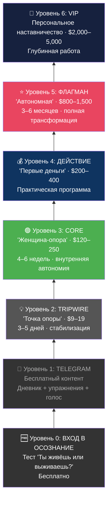

### Логика перехода между уровнями

| Этап | Внутренний процесс |
|-------|-------------------|
| Привлечение | Идентификация боли → «со мной что-то не так» |
| Осознание | Разрушение иллюзий → «это не норма» |
| Стабилизация | Внутренняя опора → «я не безнадёжна» |
| Действие | Первые деньги → «я могу» |
| Трансформация | Новая идентичность → «я взрослая» |
| Закрепление | Автономная система жизни → «я свободна» |

## 3.2 MVP — консультации (Месяц 1–3)

| Параметр | 🟢 Экспресс-разбор | 🔵 Глубокий разбор | ⭐ Неделя вместе |
|----------|:------------------:|:------------------:|:----------------:|
| **Цена** | $25 | $50 | $100 |
| **Формат** | 30 мин Zoom/TG | 60 мин Zoom | 7 дней в TG-чате |
| **Содержание** | 1 запрос → 1 убеждение → 1 инсайт | Полная распаковка + план | 1 сессия + ежедневный чекин + 2 задания |
| **Ёмкость** | до 3/день | 1/день | 5 одновременно |
| **Трансформация** | «Увидеть 1 вещь» | «Понять паттерн» | «Сделать первый шаг» |

### Финансовая математика: путь к $1,000/мес

$$
\text{Доход}_{\text{мес}} = 25 \times 12 + 50 \times 8 + 100 \times 3 = 300 + 400 + 300 = \$1{,}000
$$

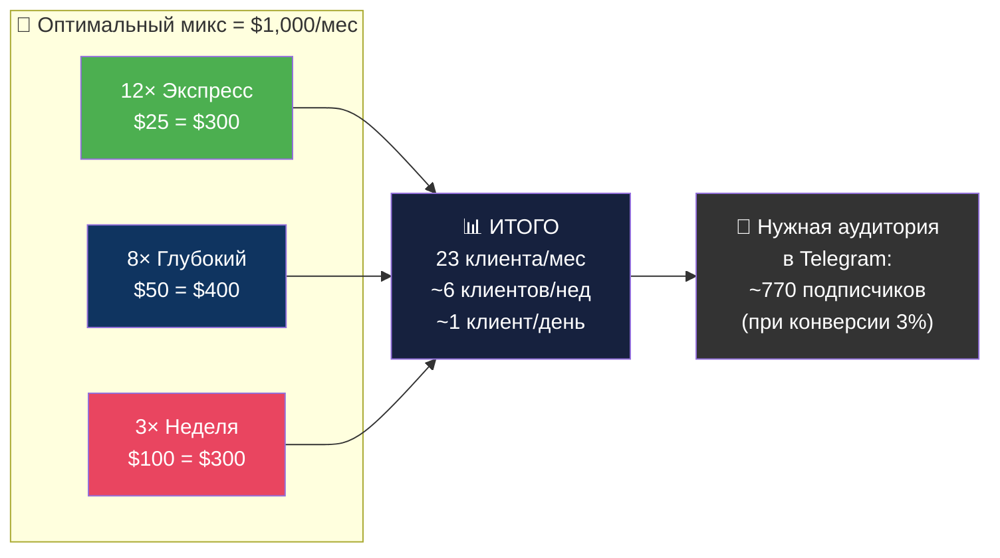

## 3.3 Масштабирование продуктов (Месяц 3–12)

| Горизонт | Уровень | Продукт | Цена | Клиенты | Доход/мес |
|----------|:-------:|---------|:----:|:-------:|:---------:|
| **Мес 1–3** | 2–3 | Консультации | $25–100 | 15–30 | $500–$1,500 |
| **Мес 3–6** | 2–4 | + Tripwire «Точка опоры» + Core «Женщина-опора» | $9–250 | 10–20/запуск | $2,000–$4,000 |
| **Мес 6–12** | 3–5 | + «Первые деньги» + Флагман «Автономная» | $200–1500 | 8–12/поток | $5,000–$15,000 |
| **Год 2** | 5–6 | + VIP-наставничество | $2000–5000 | 3–5 | $10,000–$25,000 |

### Tripwire: «Точка опоры» (новый продукт из Продуктовой линейки)

| Параметр | Значение |
|----------|----------|
| **Цена** | $9–19 |
| **Формат** | Мини-курс / аудиопрограмма / видео, 3–5 дней |
| **Результат** | «Со мной всё не безнадёжно. Я не сумасшедшая. Я в переходе. И из этого есть выход» |
| **Задача** | Снять тревогу → создать доверие → перевести из жертвы в ученицу → подготовить к глубокой работе |
| **Когда запускать** | Месяц 2–3, после 10+ консультаций |

### Позиционирование продуктов (из Продуктовой линейки)

| ❌ Не называть | ✅ Называть |
|-------------|-----------|
| Тренинги, курсы, марафоны, обучения | Переход, система, путь, трансформация, инициация, взросление |

> **Ядро смысла всей линейки:**  
> *«Ты либо создаёшь себе опору — либо живёшь на чужой. Третьего варианта нет.»*

---

# РАЗДЕЛ 4: СИСТЕМА ИСПОЛНЕНИЯ «2 ЧАСА»

## 4.1 Ежедневный план действий

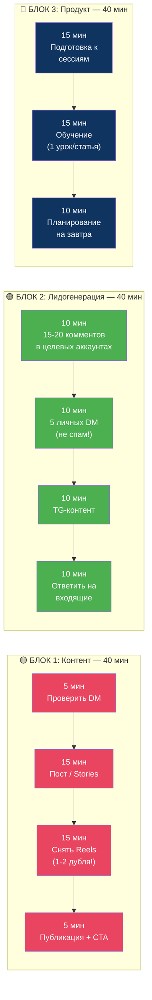

## 4.2 Протокол «Мне страшно»

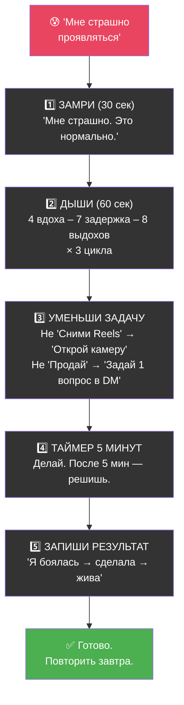

$$
\text{Действие} = f(\text{Микрошаги} \times \text{Самосострадание}), \quad \text{а НЕ} \quad f(\text{Мотивация} \times \text{Готовность})
$$

---

# СВОДНЫЕ РАЗДЕЛЫ

## SUMMARY A: Полная воронка продаж — один взгляд

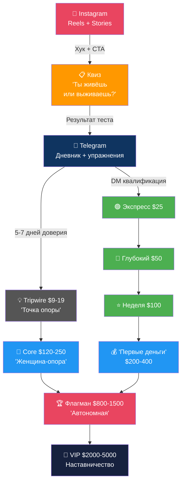

## SUMMARY B: Дорожная карта $1,000 → $15,000

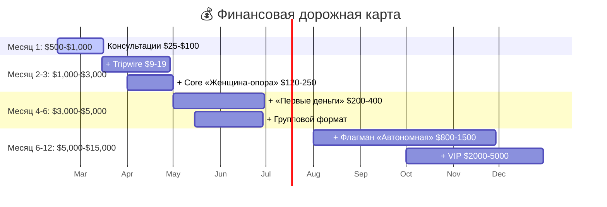

## SUMMARY C: Топ-3 критических риска

| # | Риск | Severity | Митигация |
|---|------|:--------:|-----------|
| 1 | 🔴 **Страх публичного заявления** | Критический | Протокол «Мне страшно» + правило 1-го дубля + «Я не учу. Я делюсь процессом» |
| 2 | 🟡 **Стыд «продавать в кризисе»** | Высокий | «Навык ≠ состояние. Врач лечит, даже когда болеет гриппом» + $25 = 3 кофе |
| 3 | 🟠 **Выгорание от ежедневного контента** | Высокий | Батчинг (3-4 Reels за 1 сессию) + 1 день тишины/нед + ассистент к месяцу 2 |

## ПРИЛОЖЕНИЕ: Матрица приоритетов

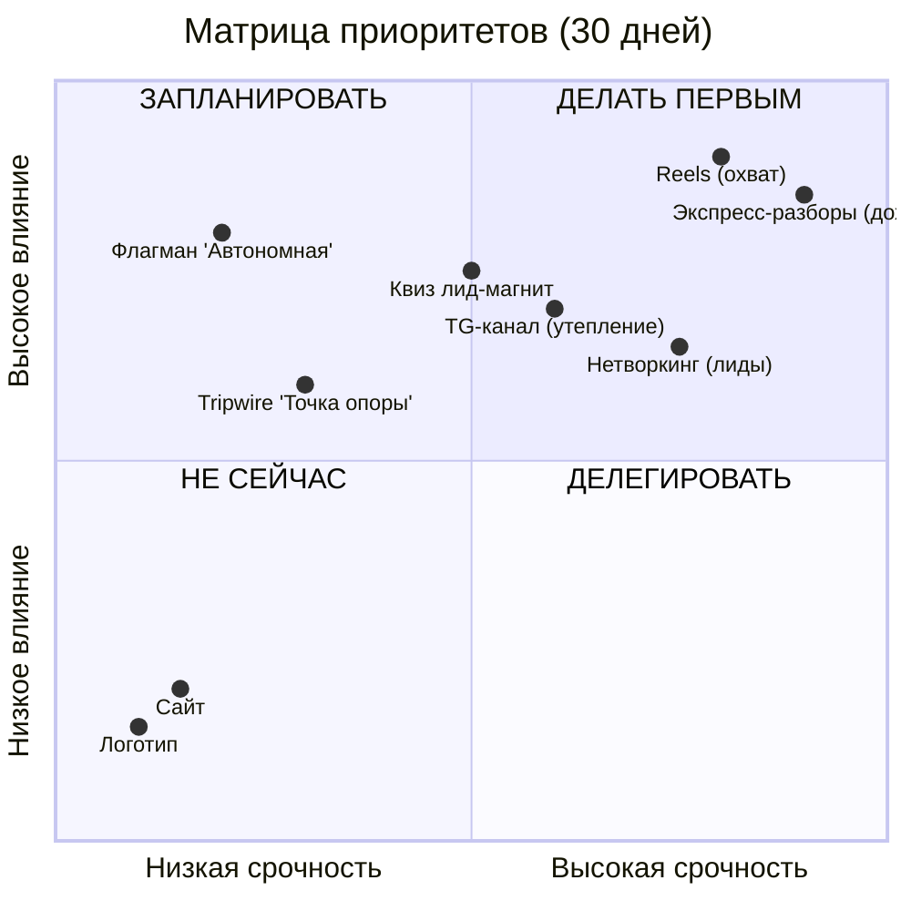

### Сводная формула стратегии

$$
\boxed{
\text{Успех}_{\text{Анна}} = \underbrace{\text{Честность}}_{\text{Позиционирование}} \times \underbrace{\text{Регулярность}}_{\text{Контент}} \times \underbrace{\text{Доступность}}_{\text{Цена}} \times \underbrace{\text{Микрошаги}}_{\text{Исполнение}}
}
$$

> [!IMPORTANT]
> ### 🎯 Главный вывод
>
> Анна — **проводник в реальном времени**. Её уязвимость — не слабость, а **главное конкурентное преимущество**. Рынок устал от «успешного успеха». Рынок голоден по настоящему.
>
> Продуктовая линейка из 7 уровней — это **психо-экономическая воронка**, где каждый уровень = этап эволюции от зависимости к автономии.
>
> **Три приоритета на ближайшие 7 дней:**
> 1. **Манифест** — опубликовать первый пост (правило 1-го дубля)
> 2. **Telegram-канал** — создать + первые 3 поста
> 3. **Первый DM-раунд** — 15 сообщений целевым аккаунтам

---

*Этот план построен на принципе «Радикальной Честности» и интегрирует: распаковку эксперта, ДНК клиента и полную продуктовую архитектуру. Здесь нет обещаний лёгкого пути. Есть система для человека, который решил действовать, пока страшно.*

*Стратегическая ревизия: через 30 дней.*
